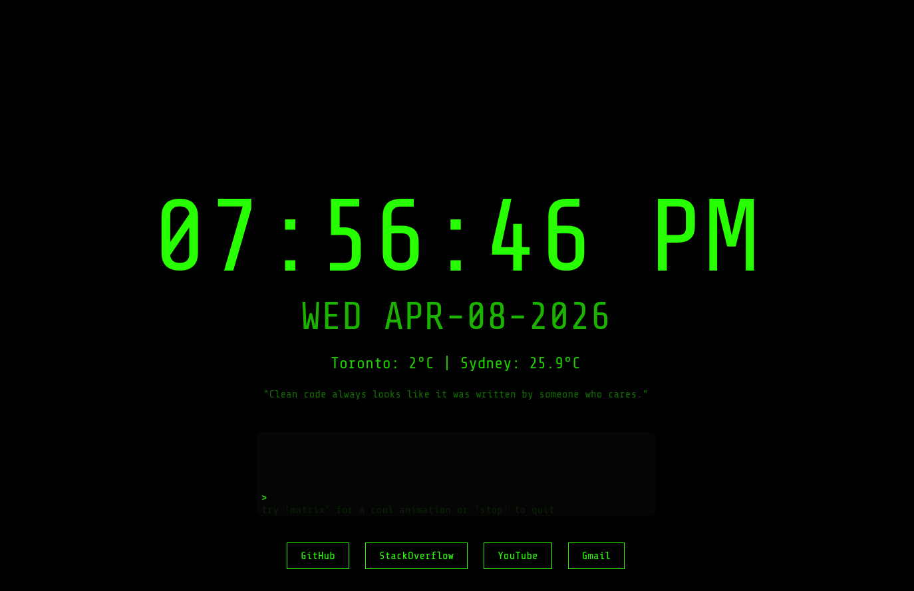

# Dev Dashboard ⚡

A minimalist developer dashboard made to work as a personal start page
or new tab: 

- Fast, simple, keyboard-driven. Just open the file and go.
- No frameworks. No builds. No dependencies, just one file.
- Built with: HTML, CSS, JS.

  

------------------------------------------------------------------------

## ✨ Features

-   Live clock & formatted date\
-   Weather (your location + random cities)\
-   Random dev quotes\
-   Fake terminal interface\
-   Command history + autocomplete\
-   Quick shortcuts & search commands\
-   Matrix rain animation background\
-   Responsive minimalist design

------------------------------------------------------------------------

## 💻 Terminal Commands

    help      show commands
    time      current time
    date      current date
    clear     clear terminal
    hello     welcome message
    matrix    start matrix rain
    stop      stop matrix rain

Shortcuts:
    git   github
    gpt   chatgpt
    mail  gmail
    stack stackoverflow

Search from terminal:
    g vue lifecycle
    yt javascript closures
    npm axios
    mdn fetch api

------------------------------------------------------------------------

## 🌧 Matrix Rain
Canvas-based animation inspired by hacker terminals.

Character set includes:
-   Latin letters & numbers
-   Symbols
-   Greek & Cyrillic
-   Arabic characters
-   Japanese Katakana & Hiragana
-   Korean Hangul
-   Chinese characters
-   Runes, braille & geometric symbols
-   try your own characters by editing the code!

Run: `matrix`
Stop: `stop`

------------------------------------------------------------------------

## 🌤 Weather
Uses Geolocation API to get your location and OpenWeatherMap API for data.
-   Current weather with icon
-   Temperature in Celsius
-   Random city weather on refresh
-   Fallback if geolocation denied or API fails
-   No API key needed, but you can add one for better reliability (see code comments)
-   Designed to be simple and fast, not a full weather app
   
------------------------------------------------------------------------

## Keep it simple and enjoy!
